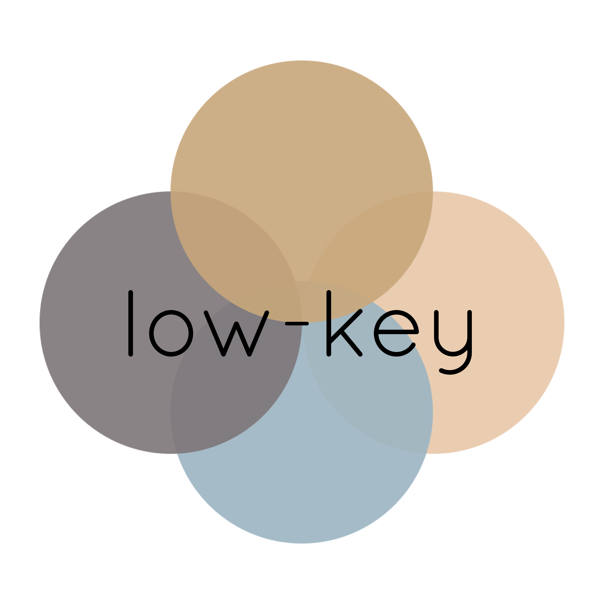
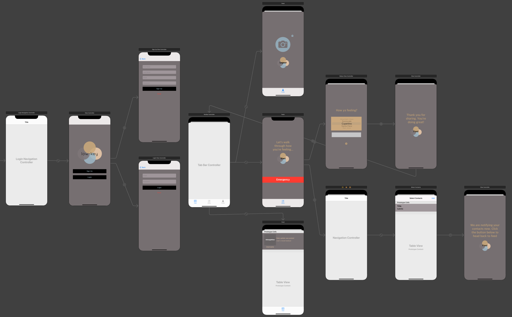
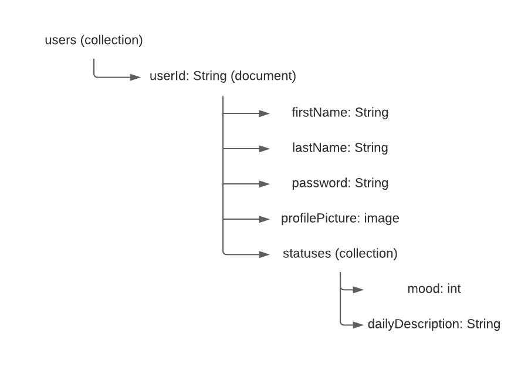

# low-key

## Table of Contents
1. [Overview](#Overview)
1. [Product Spec](#Product-Spec)
1. [Wireframes](#Wireframes)
2. [Schema](#Schema)

## Overview
### Description
A mental health app that helps you monitor your mental health and notify those you know in case of emergencies.

### App Evaluation
- **Category:** Health and Fitness
- **Mobile:** This app is designed for mobile use, as its purpose is to be an accessible health tool for the user.
- **Story:** Allows users to send selected contacts a list of emotions they’re feeling and what their needs are in times of emotional/mental distress.
- **Market:** Individuals who would like to notify their family/friends about their emotional distress.
- **Habit:** This app can be used anytime a user is feeling emotionally distressed.
- **Scope:** It will start off with a few people and their trusted circle, but the user base may grow as this app gains traction.

## Product Spec

### 1. User Stories (Required and Optional)

**Required Must-have Stories**

- [x] User can make an account.
- [x] User can sign in.
- [x] User can stay signed in.
- [x] User can log out. 
- [x] User can set a mental health status.
- [x] User can share **emergency** status with friends & family.
- [x] User can sync contacts. 
- [x] User can upload/set a profile picture.
- [x] User sees feed of feelings/statuses.

**Optional Nice-to-have Stories**

- [ ] User’s apple watch detection suggests breathing app.
- [ ] User can connect with other users on app.
- [ ] User can share location.  

### 2. Screen Archetypes

* Login
   * User can make an account.
   * User can sign in.
* Create a new status.
   * User can set a mental health status. 
   * User can sync contacts.
   * User can share status with friends & family. 
* Settings
   * User can update profile picture
   * User can log out

### 3. Navigation

**Tab Navigation** (Tab to Screen)

* Feed
* Create New Status
* Profile

**Flow Navigation** (Screen to Screen)

* Login -> Feed
* Create New Status -> Feed

## Wireframes

## Schema 
### Models
Firestore data model:

### Networking
- [Add list of network requests by screen ]
- [Create basic snippets for each Parse network request]
- [OPTIONAL: List endpoints if using existing API such as Yelp]
